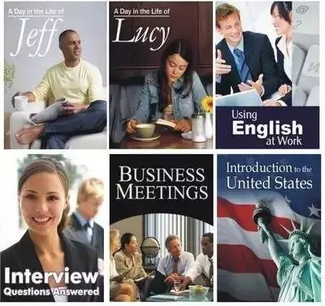
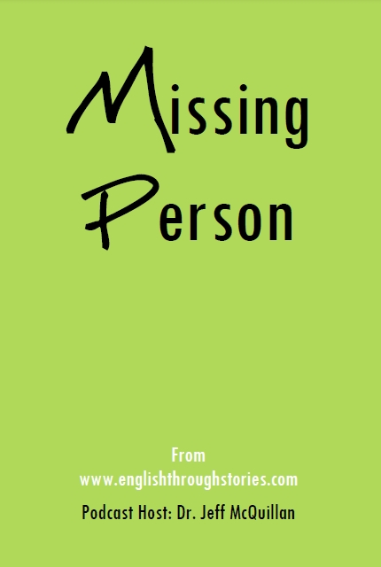

[TOC]

# EnglishLearn

## Eslpod-全世界自学人数最多的英语教程

Podcast是一种基于苹果公司的iTunes软件传播的网络广播，在国外非常流行。各大广播公司都会定期发布自己的Podcast，其音质和资源比radio（广播）要丰富得多。里面有个教育频道，一直以来在教育频道中排名第一的就是ESLPod。

ESLPod.com 的英语学习播客（Podcast）一直在 Apple iTunes 商店的英语语言类播客中排名第一，深受世界各国英语学习者的喜爱，也广受英语教育机构赞扬。自2005年开播以来，听众已经遍布全球各地，达数百万人以上。

这个播讲类材料由南加州大学Dr.Jeff McQuillan带领团队编辑制作，面向全世界提供免费的英文教学广播--Jeff博士本人既是团队领导，也是节目的首席主播。

本仓库收藏了目前ESLpod上6本广受欢迎的独立教材+1本进阶教材，含音频+PDF。分享给想通过自学提升英语能力的人。

	    

1. 《Introduction to the United States》
2. 《A Day in the Life of Jeff》
3. 《A Day in the Life of Lucy》
4. 《Interview Questions Answered》
5. 《English for Business Meetings》
6. 《Using English at Work》
7. 《Missing_Persons_English_Through_Stories》

### 1.《Introduction to the United States》

    

《Introduction to the United States》是ESLPod系列教材的重头戏。

它共有100课，每一课主持人会先把课文内容慢速朗读一遍，然后再快速朗读一遍。

内容上采用开篇给出问题---回答问题，最后详细阐述的形式。问题和回答非常简洁明了，起到一句话点题的作用，让学习者对后面大篇幅的详细阐述部分做到心中有数有的放矢。

《Introduction to the United States》除了介绍了美国的法律制度外，还包含美国地理、历史、经济等方方面面的内容。100期的音频和文本足够想要了解美国文化的学习者一次学个痛快。

### 2.《A Day in the Life of Jeff》

### 3.《A Day in the Life of Lucy》

    

第二本《A Day in the Life of Jeff》和第三本《A Day in the Life of Lucy》是类似日记的形式，以第一视角记述了Jeff和Lusy从早晨起床开始一整天的工作生活经历和一些小心思、小情绪。

Jeff 就是 ESLPod 系列的主持人 Jeff McQuillan 啦，Lusy 是ESLPod 的合伙人和幕后英雄，参与编写了 ESLPod 全系列节目内容。

《A Day in the Life of Jeff》和《A Day in the Life of Lucy》是ESLPod 六本教材中最简单的两本，基础略薄弱的同学建议从这两本开始学。

### 4.《Interview Questions Answered》

    

《Interview Questions Answered》一书中讨论了如下6个面试中最经常会问到的问题。

- Tell me about yourself.
- Why are you looking for a new job?
- Why do you want to work here?
- Where do you see yourself in five years?
- What are your strengths?
- What are your weaknesses?

《Interview Questions Answered》给出了各种面试tips, advice和suggestions。如果你想了解英文面试技巧和英语国家的面试思维，那么看这一本准没错啦。

### 5.《Using English at Work》

    

《Using English at Work》是典型的商务英语教材，它共有10课，讨论了办公室中的各种英文工作场景(从上班到下班，全过程。)，内容包含每日工作中要用到的单词、短语和句型。外企工作者必备！

- Lesson 1 - Arriving at Work
- Lesson 2 - Checking Mail, Email, and Voicemail
- Lesson 3 - Attending the Morning Meeting
- Lesson 4 - Working at My Desk
- Lesson 5 - Taking a Break and Eating Lunch
- Lesson 6 - Having Computer Problems
- Lesson 7 - Scheduling a Meeting
- Lesson 8 - Meeting With the Boss
- Lesson 9 - Leaving Work
- Lesson 10 - Socializing With Coworkers

### 6.《English for Business Meetings》

    

《English for Business Meetings》是专为商务会议准备的英语课程。全书按照会议的环节分为10课，每一课又包含正式会议与非正式会议两个版本，让学习者同时熟悉正式和非正式会议情形下要使用到的不同英语表达。

课程内容包括：

- Starting a Meeting
- Introducing the Participants
- Beginning a Presentation
- Giving a Presentation
- Using Visuals at a Presentation
- Ending a Presentation
- Managing Discussion
- Taking Questions
- Ending a Topic and Planning for the Future
- Ending Formal and Informal Meetings

### 7.《Missing_Persons_English_Through_Stories》

    

《Missing_Persons_English_Through_Stories》适用于希望提高听力和口语技能的高级英语人士。

## ESLPod参考使用指南

1、首先不要看教材文本，花上两三天时间，仔细全本书的音频听完，放心，Jeff讲课非常细心，生词都一个个拼写出来，绝对不用担心听不懂——如果不是因为生词原因而听不懂，听的时候绝对不要做别的事情，要拿出笔记本，做好笔记。

2、初步听完后，开始读教材，花个3-4天时间，对照着笔记把教材文本里面的生词短语之类的都搞定。

3、之后开始进行跟读的练习，每天跟读多少的量，多长时间要自己安排，以能接受为准。跟读练习是这里的重头戏，推荐大家对教材最好全文跟读，不管是讲解还是单纯的课程录音，对形成你的语感帮助更大，在你定好了每天要跟读量之后，一般意义上的跟读分成三种方法：

丢开课本，播放一句，暂停，然后跟读，如果跟不了，倒带反复

翻开课本，不暂停，跟着录音反复朗读

丢开课本，不暂停，跟着录音反复朗读

4、复习，复习只需要把以前学过的课程使用第二种或者第三种跟读方法跟读几遍就可以了。

最后，祝大家学习愉快！

**END**
